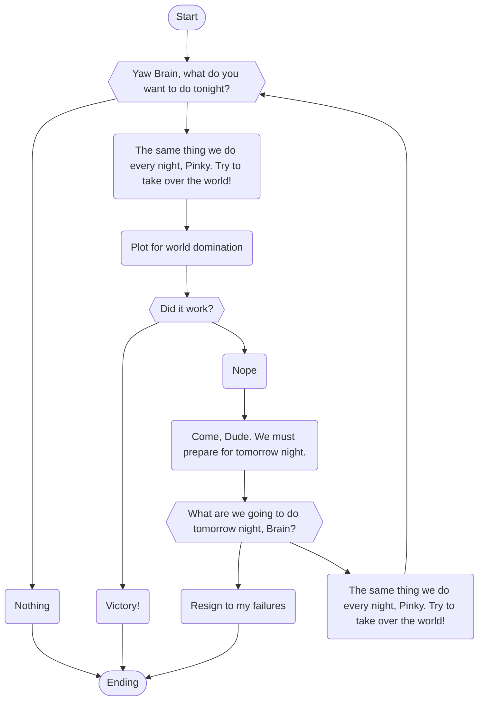

#Hello
$$
\begin{aligned}
\text{For } u = f(x), v = g(x) \\
\frac{d}{dx}(u \pm v) &= \frac{du}{dx} \pm \frac{dv}{dx} && \text{Sum/Difference Rule} \\
\frac{d}{dx}(u \cdot v) &= \frac{du}{dx} \cdot v + u \cdot \frac{dv}{dx} && \text{Product Rule} \\
\frac{d}{dx}\left(\frac{u}{v}\right) &= \frac{\frac{du}{dx} \cdot v - u \cdot \frac{dv}{dx}}{v^2} && \text{Quotient Rule}, v \ne 0
\end{aligned}
$$

